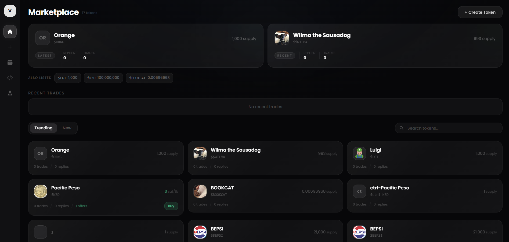

<div align="center">

# vtxo.market

**A permissionless, non-custodial token marketplace on Bitcoin.**

Tokens are issued as [Arkade](https://arkade.sh) assets (VTXOs on the Ark protocol) and traded via non-interactive atomic swaps that settle on Bitcoin.

No custody. No platform fees. Self-custodied wallets from a 12-word seed phrase.

[](https://github.com/lendasat/vtxomarket/actions/workflows/ci.yml)
[](./LICENSE)

<br />



</div>

---

## Features

- **Issue tokens** on Bitcoin as Arkade Assets — no smart contract deployment needed
- **Trade atomically** — maker receives sats, taker receives tokens, or nothing happens
- **Non-interactive swaps** — no coordination required between maker and taker
- **Cancel anytime** — cooperatively via ASP, or unilaterally on-chain after CSV timelock
- **Self-custodied** — 12-word seed phrase, keys never leave your browser
- **Lightning support** — send and receive via [Boltz](https://boltz.exchange) atomic swaps
- **Social layer** — token threads and trade receipts via [Nostr](https://nostr.com)

## Architecture

```
┌──────────────┐     ┌──────────────┐     ┌───────────────┐
│   Frontend   │────▶│   Indexer    │────▶│  Ark Server   │
│  (Next.js)   │     │  (Bun/Hono)  │     │    (arkd)     │
│   :3000      │     │   :3001      │     └───────────────┘
│              │     └──────────────┘
│              │     ┌──────────────┐
│              │────▶│ Introspector │
│              │     │   :7073      │
└──────────────┘     └──────────────┘
```

| Service | Role |
|---|---|
| **Frontend** | Next.js app — marketplace UI, wallet, trading |
| **Indexer** | Tracks asset metadata, VTXO state, and swap offers (Bun + SQLite + Hono) |
| **[Introspector](https://github.com/ArkLabsHQ/introspector)** | Validates Arkade Script conditions and co-signs swap PSBTs |

See [ARCHITECTURE.md](./ARCHITECTURE.md) for the full swap protocol design, security properties, and opcode-level analysis.

## Quick start

### Prerequisites

- [Node.js](https://nodejs.org/) v20+
- [Bun](https://bun.sh/) v1.1+ (for the indexer)
- [Docker](https://www.docker.com/) (for the Introspector)

### 1. Clone and install

```bash
git clone https://github.com/lendasat/vtxomarket.git
cd vtxomarket
npm install
cp .env.example .env
```

### 2. Start backend services

The easiest way is with Docker Compose:

```bash
cp .env.indexer.example .env.indexer
cp .env.introspector.example .env.introspector

# Generate a secret key for the Introspector
echo "INTROSPECTOR_SECRET_KEY=$(openssl rand -hex 32)" >> .env.introspector

docker compose up -d
```

Or start them individually:

<details>
<summary>Manual setup</summary>

**Indexer:**

```bash
cd indexer
cp .env.example .env
bun install
bun run src/index.ts
```

**Introspector:**

```bash
git clone https://github.com/ArkLabsHQ/introspector.git
cd introspector
docker build -t introspector .
docker run -d --name introspector \
  -p 7073:7073 \
  -e INTROSPECTOR_SECRET_KEY=$(openssl rand -hex 32) \
  -e INTROSPECTOR_NO_TLS=true \
  introspector
```

Verify: `curl http://localhost:7073/v1/info` should return `{"signerPubkey": "..."}`.

</details>

### 3. Start the frontend

```bash
npm run dev
```

Open [http://localhost:3000](http://localhost:3000).

## Environment variables

Copy `.env.example` to `.env` and configure:

| Variable | Default | Description |
|---|---|---|
| `NEXT_PUBLIC_ARK_SERVER_URL` | `https://mutinynet.arkade.sh` | Ark server URL |
| `NEXT_PUBLIC_ESPLORA_URL` | `https://mutinynet.com/api` | Bitcoin block explorer API |
| `NEXT_PUBLIC_BOLTZ_URL` | `https://api.boltz.mutinynet.arkade.sh` | Boltz API for Lightning swaps |
| `NEXT_PUBLIC_INDEXER_URL` | `http://localhost:3001` | Asset indexer URL |
| `NEXT_PUBLIC_INTROSPECTOR_URL` | `http://localhost:7073` | Introspector URL |
For mainnet, use `https://arkade.computer`, `https://mempool.space/api`, and `https://api.ark.boltz.exchange`.

## Project structure

```
vtxomarket/
├── src/
│   ├── app/                       # Next.js pages
│   │   ├── page.tsx               # Marketplace home
│   │   ├── create/                # Token issuance
│   │   ├── token/[id]/            # Token detail, order book, thread
│   │   ├── wallet/                # Holdings, send/receive, Lightning, stablecoins
│   │   └── settings/              # Profile, keys
│   ├── lib/
│   │   ├── ark-wallet.ts          # Arkade SDK wrapper
│   │   ├── swap_protocol/         # Non-interactive swap implementation
│   │   │   ├── light-fill.ts      # Taker fill flow (submitTx/finalizeTx)
│   │   │   ├── offers.ts          # Create + cancel offers
│   │   │   ├── script.ts          # 3-leaf taproot tree + arkade script
│   │   │   └── psbt-combiner.ts   # BIP-174 multi-party signature merging
│   │   ├── nostr-market.ts        # Nostr events (comments, trade receipts)
│   │   └── lightning.ts           # Boltz Lightning swaps
│   └── hooks/                     # React hooks (useWallet, useOffers, useTokens, ...)
├── indexer/                       # Asset indexer (Bun + SQLite + Hono)
├── docker-compose.yml             # Run indexer + introspector
├── ARCHITECTURE.md                # Swap protocol deep-dive
└── .env.example
```

## Tech stack

| Layer | Technology |
|---|---|
| Settlement | Bitcoin via [Ark protocol](https://ark-protocol.org) |
| Offchain execution | [@arkade-os/sdk](https://github.com/arkade-os/wallet) |
| Swap co-signing | [Arkade Introspector](https://github.com/ArkLabsHQ/introspector) |
| Social layer | [Nostr](https://nostr.com) (NDK) |
| Indexer | [Bun](https://bun.sh) + SQLite + [Hono](https://hono.dev) |
| Frontend | [Next.js 16](https://nextjs.org) + [Tailwind CSS v4](https://tailwindcss.com) |
| Lightning | [Boltz](https://boltz.exchange) atomic swaps |

## Network support

| Network | Block time | Notes |
|---|---|---|
| **Mutinynet** (default) | ~30s | Free faucet at [faucet.mutinynet.com](https://faucet.mutinynet.com) |
| **Mainnet** | ~10min | Change env vars to mainnet URLs |

## Contributing

Contributions welcome. Please read [ARCHITECTURE.md](./ARCHITECTURE.md) before diving into the swap protocol code.

```bash
# Format code before submitting
npm run format

# Check formatting + lint
npm run format:check
npm run lint
```

## License

[MIT](./LICENSE)
